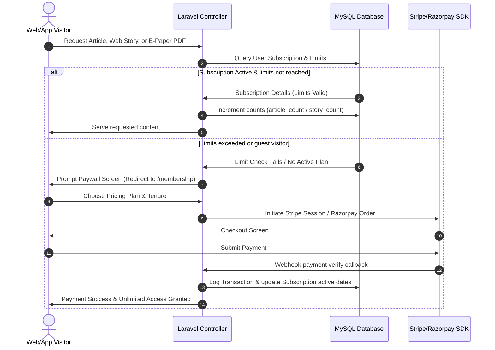

# NewsHunt Tech Stack & Coding Guidelines (Full System Blueprint)

This document is the comprehensive, end-to-end blueprint of the **NewsHunt** codebase. It outlines the tech stack, library components, frontend assets, database models, business logic modules, routing tables, and optimization patterns. 

Every AI coding agent modifying, maintaining, or adding features to this repository **MUST** follow these guidelines to prevent regression and ensure feature parity.

---

## 1. Tech Stack, Libraries & Architecture Patterns

NewsHunt is a multi-channel news, audio, video, web stories, and e-paper portal built on the Laravel framework.

### A. Backend Tech Stack & Libraries
* **Framework:** Laravel 10/11 MVC (Model-View-Controller) architecture.
* **PHP Target Version:** PHP 8.1+ (strict enforcement of null safety for PHP internal methods).
* **Database:** MySQL (relational structure with foreign key cascading and indices).
* **Authentication:** Laravel Session Authentication (Web Frontend) & Laravel Sanctum (Token-based mobile REST APIs).
* **Role & Permission Management:** Driven by Spatie Permission (`permission` and `role` middleware guards).
* **Image Processing:** Intervention Image library (handles aspect ratio constraints, resizing, and WebP encoding).
* **Asset Installer:** Laravel Wizard Installer (`dacoto/laravel-wizard-installer`) for database setup, migrations seeding, and system environment keys validation.
* **Logs Monitoring:** Log Viewer (`rap2hpoutre/laravel-log-viewer`) for tracking real-time error streams.

### B. Frontend Tech Stack & Libraries
* **Grid & Framework Layouts:** UIKit framework (structures responsive columns, carousels, accordions, and modals).
* **Carousel Engine:** SwiperJS (handles slider pagination, touch slides, navigation arrows).
* **Toasters & Alerting:** iziToast (lightweight alert toasts) & SweetAlert2 (custom dialog boxes).
* **Animations:** DotLottie player (`dotlottie-player` script) for rendering vectorized interactive Lottie loaders.
* **Icons:** Bootstrap Icons (`bi-` prefixed SVG fonts).

### C. Design Patterns
* **Service Layer Pattern:** 
  * [FileService.php](file:///c:/Users/user/Downloads/Code%20-%20v1.4.9/app/Services/FileService.php) abstracts upload processing, folder hashing, and image compression.
  * [CachingService.php](file:///c:/Users/user/Downloads/Code%20-%20v1.4.9/app/Services/CachingService.php) abstracts reading site configurations and default active languages from the server-side cache.
* **Traits Pattern:** 
  * `SelectsFields` trait ([SelectsFields.php](file:///c:/Users/user/Downloads/Code%20-%20v1.4.9/app/Traits/SelectsFields.php)) standardizes selection projections, selecting only necessary table columns (e.g. `POST_ID`, `CHANNEL_NAME`, `POST_TITLE`) to optimize database payload transmissions.
* **Request-Level attributes:** Stores parameters (like user settings, current active subscription) scoped to single HTTP threads inside Swoole/FrankenPHP to prevent memory leaks.

---

## 2. Directory Structure & Key Files

```
app/
├── Console/
│   └── Kernel.php                 # Scheduler kernel (executes RSS fetch, expired plans daily checks)
│
├── Helpers/
│   └── helper.php                 # Global helpers (theme resolver, versioned assets, etc.)
│
├── Http/
│   ├── Controllers/
│   │   ├── AdminControllers/      # CMS Administration & Configuration Panels
│   │   │   ├── PostController.php # Manage Articles (standard post formats)
│   │   │   ├── ChannelController.php # Manage channels (logos, status)
│   │   │   ├── TopicController.php # Category CRUD & sorting order
│   │   │   ├── StoryController.php # Web Stories and slide management
│   │   │   ├── ENewspaperController.php # Newspaper PDF document uploader
│   │   │   ├── SettingController.php # System settings, company profile, SMTP, API keys
│   │   │   ├── NewsLanguageController.php # Content language manager (Web vs. Content languages)
│   │   │   ├── SubscriptionController.php # Subscriber plan logs & transactions
│   │   │   ├── PricingPlanController.php # Plan packages pricing, durations, limits
│   │   │   ├── CustomAdsRequestController.php # Review advertiser campaigns
│   │   │   ├── VideoAdminController.php # Video uploads (custom vs. YouTube)
│   │   │   └── AudioPostAdminController.php # Audio posts & podcasts
│   │   │
│   │   ├── Apis/                  # Mobile App REST API Controllers (Sanctum guarded)
│   │   │   ├── UserLoginController.php # Client register, login, profile updates
│   │   │   ├── FetchRssFeedController.php # Eager-loaded homepage content feeds for mobile
│   │   │   ├── MembershipApiController.php # Subscription orders & payments verify
│   │   │   └── CustomAdsApiController.php # Mobile ads tracking and fetching
│   │   │
│   │   ├── HomeController.php     # Web Homepage feed builder (caching, de-duplication)
│   │   ├── PostDetailController.php # Single post pages, reactions, bookmark checks
│   │   ├── WebStory.php           # Web Stories slider views & story views cookies
│   │   └── PaymentController.php  # Web checkout processors (Stripe & Razorpay)
│   │
│   └── Middleware/
│       ├── AdminLocale.php        # Set localization locale for Admin panel
│       ├── WebLocale.php          # Set localization locale for Web client
│       └── TrackUserVisit.php     # Log visitor counts in DB
│
├── Models/                        # Core Database Entities
│   ├── User.php                   # End-user profile and transaction relationships
│   ├── Admin.php                  # Admin and editor panel operators
│   ├── Post.php                   # Core articles (text, custom video, youtube, audio formats)
│   ├── Topic.php                  # Post Category categorization
│   ├── Channel.php                # Publisher/feed identities
│   ├── Story.php                  # Stories hosting StorySlide sets
│   ├── StorySlide.php             # Individual slides (contains animation configs)
│   ├── ENewspaper.php             # PDF publications (newspapers/magazines)
│   ├── Subscription.php           # Customer subscription states and limits checker
│   ├── Transaction.php            # Transaction receipts for subscriptions
│   ├── Plan.php                   # Membership plans (article, story, e-paper thresholds)
│   ├── Setting.php                # System configuration parameters
│   ├── Reaction.php               # Core post reaction templates (like, celebrate, love, etc.)
│   ├── BlockedComment.php         # Banned comment items
│   ├── ReportComment.php          # Flagged comment logs
│   ├── ReportType .php            # Comment reporting reason templates
│   ├── RssFeed.php                # RSS URLs parsed by crawlers
│   ├── SmartAd.php                # Dynamic sponsor ads
│   └── DailyReadStat.php          # Logs read counts per day
│
└── Services/
    ├── CachingService.php         # Fast read caching layer for settings/languages
    └── FileService.php            # Media uploads, WebP conversion, and aspect ratio compression
```

---

## 3. Frontend Assets: JS & CSS Specifications

All web assets live under `public/front_end/classic/`.

### A. JavaScript Engines
* **[custom-jquery.js](file:///c:/Users/user/Downloads/Code%20-%20v1.4.9/public/front_end/classic/js/custom/custom-jquery.js) (Frontend Core):**
  * Controls dynamic Swiper carousels lifecycle and AJAX pagination boundaries.
  * Fetches, coordinates, and appends JSON dynamic feeds for category dropdowns and slider feeds (Most Read, Web Stories, Top Posts, and Followed Channels).
  * Exposes client-side template engines (`buildTopicDropdownPostHtml`, `buildMostReadSlideHtml`, etc.) to parse attributes, format localized date templates, and paint clean cards.
  * Orchestrates `window.lazyLoadElements()` IntersectionObserver triggers to evaluate newly loaded elements.
* **[search-news.js](file:///c:/Users/user/Downloads/Code%20-%20v1.4.9/public/front_end/classic/js/custom/search-news.js) (Search Controller):**
  * Synchronizes interactive controls between the mobile canvas sidebar drawer and desktop filters layout.
  * Intercepts modal and header autocomplete checks, triggering window redirects to `/posts?search=query` rather than internal modal alerts.
  * intercepts grid pagination clicks to reload search feeds asynchronously via AJAX, updates URL histories using `window.history.pushState()`, and scrolls user viewport smoothy to `#content-area`.
* **[app-head-bs.js](file:///c:/Users/user/Downloads/Code%20-%20v1.4.9/public/front_end/classic/js/app-head-bs.js) (Pre-load Guards):**
  * Used to execute layout setups before layout renders. Preloader triggers are now handled via inline head listeners to prevent asset-caching flashes.

### B. CSS System & Layout Styling
* **Global Custom CSS:** Maintained in `public/front_end/classic/css/custom.css`.
* **Layout Stability (CLS Prevention):**
  * `.epaper_css` preserves a fixed `300px` height container block to prevent page shifts.
  * Custom Swiper anti-shift overrides hide secondary slides in uninitialized carousels:
  ```css
  .swiper:not(.swiper-initialized) .swiper-slide:not(:first-child) {
      display: none !important;
  }
  ```

---

## 4. End-to-End Core Data Flows & Logic

### A. Subscription Checkout & Paywall Verification



### B. Homepage Feed Aggregation & De-duplication
1. User accesses home `/` -> [HomeController@index](file:///c:/Users/user/Downloads/Code%20-%20v1.4.9/app/Http/Controllers/HomeController.php) executes.
2. Direct raw Query Builder selects Settings to prevent 146 Model Hydrations.
3. Consolidates database fetches by querying the top 32 latest posts globally.
4. Performs collection filter using `unique('title')` in memory.
5. Invokes Laravel `$collection->shuffle()` to randomize homepage layout on each reload.
6. Slices the shuffled collection: Banners, Top Posts, Latest News.
7. Stores computed IDs in request cache attributes to exclude them in subsequent sub-queries (Followed Channels loops) using `whereNotIn('posts.id', $displayedIds)`.

### C. Web Stories View Counting & Anti-Spam
1. User clicks to read a Web Story -> [WebStory@show](file:///c:/Users/user/Downloads/Code%20-%20v1.4.9/app/Http/Controllers/WebStory.php) executes.
2. Checks user subscription details to evaluate Web Story view limits.
3. Checks if visitor has `viewed_story_{story_id}` cookie:
   * **If missing:** Increments `story_count` on `stories` table and queues the cookie with a 15-day (21,600 minutes) expiration.
   * **If present:** Skips database writes to prevent duplicate counter refresh exploits.
4. Loads slides, packages layout animations metadata, and renders view.

### D. Automated RSS Ingestion Flow
1. Laravel Scheduler executing `app/Console/Kernel.php` runs the `rss:fetch` command every 15 minutes.
2. The command pulls registered `RssFeed` XML URLs from the database.
3. Downloads feed XML payloads using cURL/Guzzle.
4. Parses XML tags (GUID, Title, Content, Image URLs).
5. Sanitizes title and matches against existing titles/slugs to discard duplicate items.
6. Downloads raw post main image, resizes to 800px width max, compresses to 60% quality, encodes to WebP format using `FileService`, and saves to disk.
7. Saves the new ingested record to the `posts` database table.

### E. User Localization & Locale Selection
1. Visitor selects content language or accesses homepage.
2. `WebLocale` middleware checks `web_locale` session:
   * **Session set:** Configures standard framework locale: `app()->setLocale(session('web_locale'))`.
   * **Session empty:** Defaults to fallback database locale.
3. For logged-in users, content language filters look up subscriber associations (`NewsLanguageSubscriber`). For guests, content filters default to the browser session language or active news languages.

---

## 5. Performance Optimizations & Developer Rules

### A. Request-Scoped Cache Protection
* **Rule:** Do **NOT** use PHP class `static` properties inside providers, helpers, or controllers to cache data during execution. In persistent environments (FrankenPHP, Swoole, RoadRunner), static properties persist between HTTP requests, bleeding user states.
* **Pattern:** Use Laravel request attributes (`request()->attributes`) to cache variables for the duration of a single HTTP request.

### B. Global View Composer Caching & Invalidation
* **Pattern:** The wildcard view composer inside [AppServiceProvider.php](file:///c:/Users/user/Downloads/Code%20-%20v1.4.9/app/Providers/AppServiceProvider.php) binds common layout lists (topics, channels, settings, sidebars) to all Blade views. To prevent executing 15+ database queries per request, this dataset is cached using `Cache::remember` for 10 minutes (600 seconds).
* **Key Scoping:** The cache key is scoped dynamically by active language configurations and a `view_composer_cache_buster` timestamp suffix.
* **Cache Invalidation:** Event listeners (booted in `AppServiceProvider`) listen for model updates on `Language`, `NewsLanguage`, `Setting`, and `NewsLanguageStatus`. When altered by administrators, they increment `view_composer_cache_buster`, immediately forcing a cache miss across all sessions.

### C. Preventing Model Hydration Blowup
* **Rule:** Eloquent model instantiation consumes significant CPU and memory. When displaying posts in loops (such as categories or channels), do **NOT** fetch all matching rows from the database.
* **Pattern:** Use database-level limits (`take(5)`) or raw Query Builder selections (`DB::table('settings')->select(...)`) to fetch configuration records, avoiding the creation of 100+ Eloquent models.

---

## 6. PHP 8.1+ Compatibility Guidelines

* **Deprecation Safeguard:** Standard functions (like `html_entity_decode`, `str_starts_with`, `preg_match`) will throw fatal deprecation errors in PHP 8.1+ if passed `null` variables. Always null-coalesce variables passed to these methods:
```php
$decoded = html_entity_decode($post->description ?? '');
```
